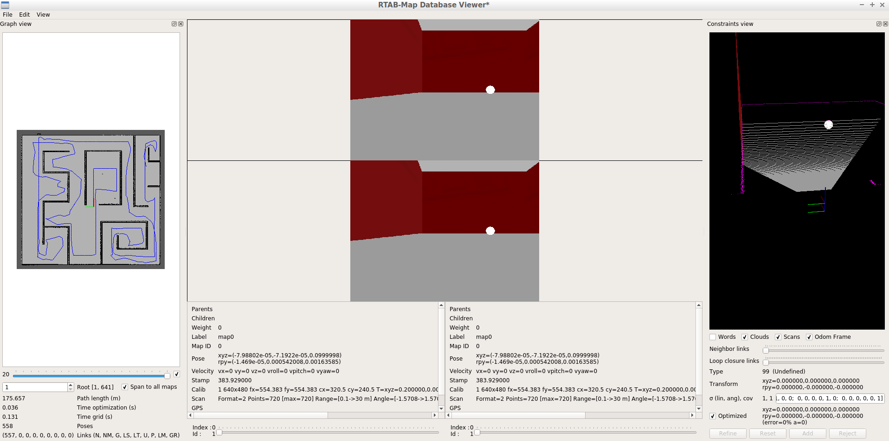

# RoboND-Map-My-World-P4
Using RTAB-Map &amp; SLAM Project with ROS kinetic, Project  (Where Am I) Solution for Udacity Robotics Software Engineer Nanodegree Program




# Project Overview

Welcome to the  `Where Am I?`  localization project! In this project, We will learn to utilize ROS AMCL package to accurately localize a mobile robot inside a map in the Gazebo simulation environments.


-   Create a ROS package that launches a custom robot model in a custom Gazebo world
    
-   Utilize the ROS AMCL package and the Tele-Operation / Navigation Stack to localize the robot
    
-   Explore, add, and tune specific parameters corresponding to each package to achieve the best possible localization results


### Native Installation & Virtual Machine

If you are working with a native ROS installation or using a VM, some of the following package might need to be installed. You could install them as shown below:

```
$ rosdep install -i rtabmap_ros

```


# Teleop Package

If you prefer to control your robot to help it localize itself as you did in the lab, you would need to add the  `teleop`  node to your package. Thanks to the ROS community, we could use  `ros-teleop`  package to send command to the robot using keyboard or controller.

Clone the  `ros-teleop`  package to your  `src`  folder:

```
cd /home/workspace/catkin_ws/src
git clone https://github.com/ros-teleop/teleop_twist_keyboard

```

Build the package and source the setup script:

```
cd ..
catkin_make
source devel/setup.bash

```

Now you could run the  `teleop`  script as is described in the  `README`  file:

```
rosrun teleop_twist_keyboard teleop_twist_keyboard.py
```

or 

```
roslaunch my_robot teleop.launch
```

# Project  Directory Structure
```
        .[RoboND-Map-My-World-P4]              # Map My World
	├── my_robot                               # my_robot package        
	│   │   ├── config                         # config folder for configuration files   
	│   │   │   ├── base_local_planner_params.yaml
	│   │   │   ├── costmap_common_params.yaml
	│   │   │   ├── global_costmap_params.yaml
	│   │   │   ├── local_costmap_params.yaml
	│   │   ├── launch                         # launch folder for launch files   
	│   │   │   ├── amcl.launch
	│   │   │   ├── robot_description.launch
	│	│	│	├── mapping.launch
	│   │   │   ├── world.launch
	│   │   ├── maps                           	   # maps folder for maps
	│   │   │   ├── map.pgm
	│   │   │   ├── map.yaml
	│   │   ├── meshes                         # meshes folder for sensors
	│   │   │   ├── hokuyo.dae
	│   │   ├── rviz                           # rviz folder for rviz configuration files
	│   │   │   ├── default.rviz
	│   │   ├── urdf                           # urdf folder for xarco files
	│   │   │   ├── my_robot.gazebo
	│   │   │   ├── my_robot.xacro
	│   │   ├── worlds                         # world folder for world files
	│   │   │   ├── empty.world
	│   │   │   ├── myworld.world
	│   │   ├── CMakeLists.txt                 # compiler instructions
	│   │   ├── package.xml                    # package info
	│   ├── teleop_twist_keyboard              # teleop_twist_keyboard
	│   │   ├── CHANGELOG.rst                  # change log
	│   │   ├── CMakeLists.txt                 # compiler instructions
	│   │   ├── README.md                      # README for documentation
	│   │   ├── package.xml                    # package info
	│   │   ├── teleop_twist_keyboard.py       # keyboard controller
                         
```


## Create the  `my_robot`  Package

**Create and initialize a  `catkin_ws`**
Feel free to skip if you already have a  `catkin_ws`.

```
$ mkdir -p /home/workspace/catkin_ws/src
$ cd /home/workspace/catkin_ws/src
$ catkin_init_workspace
```
#### Clone or Download This Project Under the /home/workspace/catkin_ws/src
```
$ cd /home/workspace/catkin_ws/src
$ git clone https://github.com/umtclskn/RoboND-Map-My-World-P4
```

## Build Package

```
$ cd /home/workspace/catkin_ws/
$ catkin_make
```

# RTAB-Map Pacakge

The best place to start is on the RTAB-Map ROS Wiki page.
http://wiki.ros.org/rtabmap_ros

# Launching

You have your robot, your map, your localization and navigation nodes. Let’s launch it all and test it!

First, launch the simulation:

```
$ cd /home/workspace/catkin_ws/
$ roslaunch <YOUR PACKAGE NAME> <YOUR WORLD>.launch

```

```
roslaunch my_robot teleop.launch
```

In a new terminal, launch the  `map`  launch file:

```
$ roslaunch <YOUR PACKAGE NAME> mapping.launch

```

### Open mapping database:

Download rtabmap.db file from : https://tinyurl.com/y7fzah3q
```
$ rtabmap-databaseViewer  rtabmap.db
```

Need to add some windows to get a better view of the relevant information, so:

Say yes to using the database parameters
View -> Constraint View
View -> Graph View


